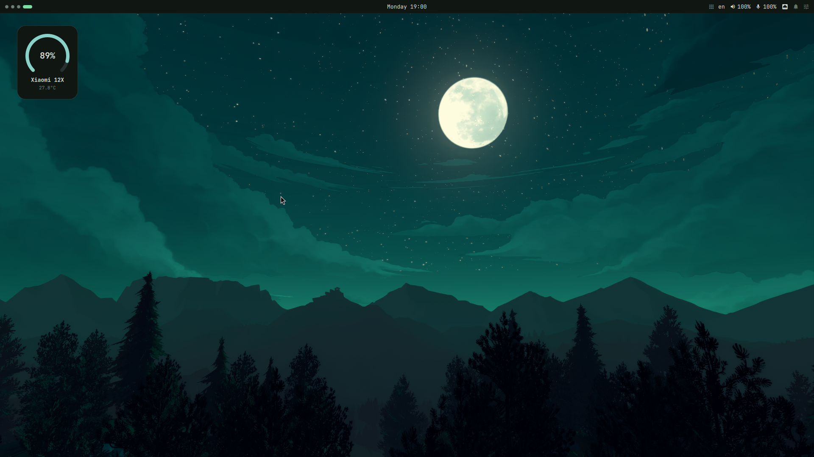
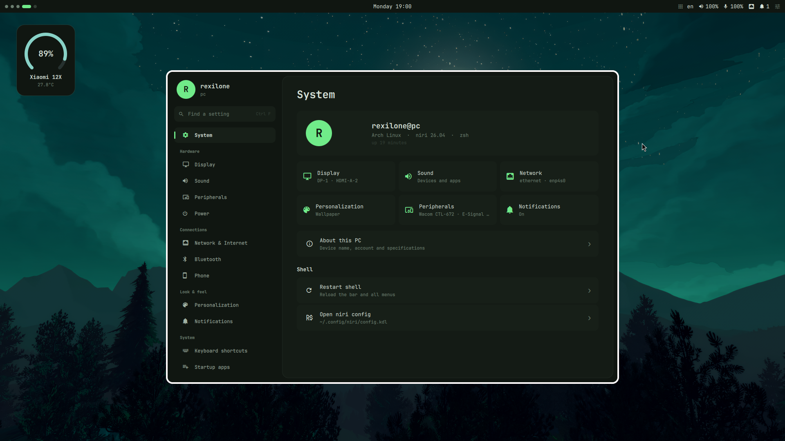
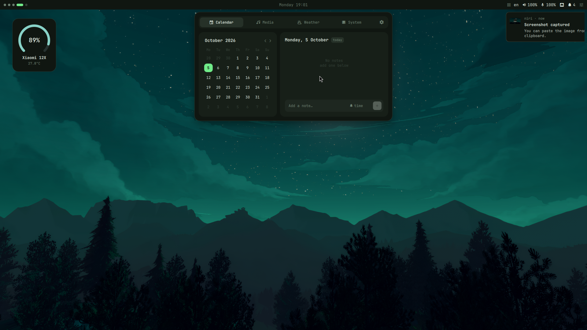
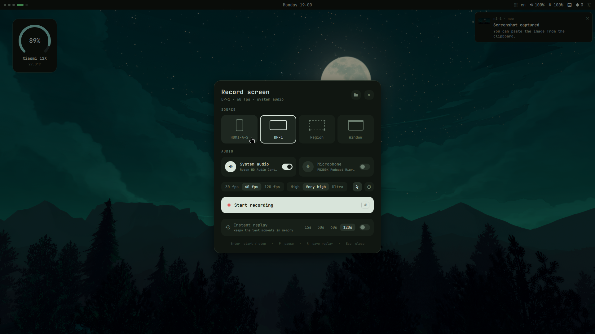
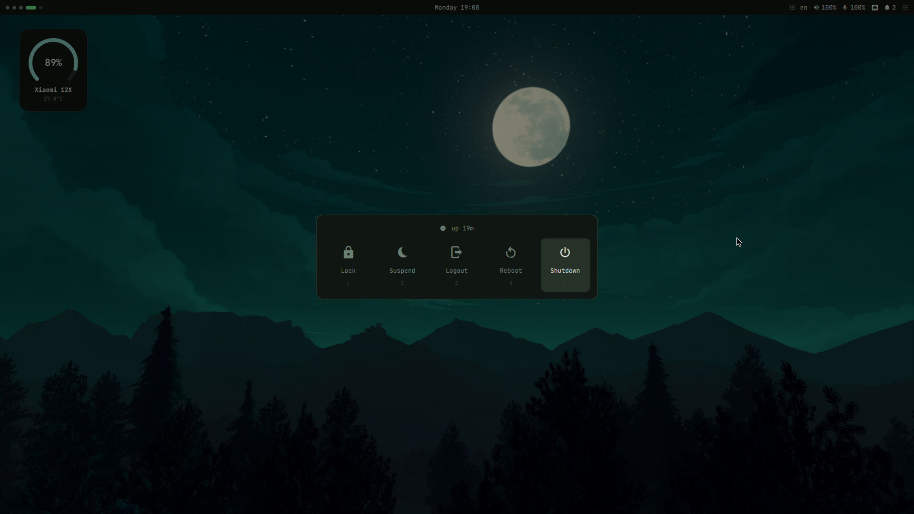
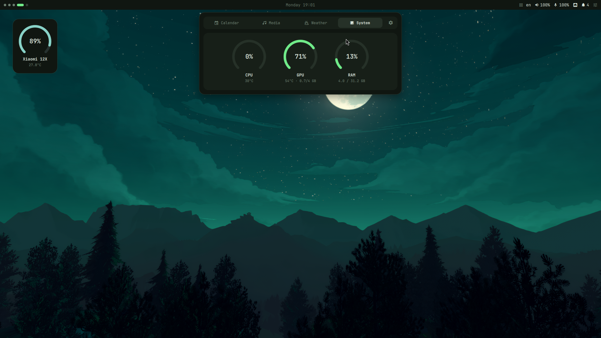

<div align="center">

# Rexilone Shell

**Минималистичное рабочее окружение на [niri](https://github.com/YaLTeR/niri) + [Quickshell](https://quickshell.org)**

Бар, меню, приложение настроек, запуск приложений, уведомления, виджеты и запись экрана —
одна цветовая схема для оболочки, терминала, Neovim, yazi, GTK-приложений и даже Steam.

[English](README.md) · [Установка](#установка) · [Возможности](#возможности) · [Телефон](#телефон-rexlink) · [Обновления](#обновления)



</div>

## Скриншоты

| | |
|---|---|
|  |  |
| **Настройки** — минималистичные, всё в одном месте | **Меню часов** — календарь с заметками и напоминаниями, плеер, погода, система |
|  |  |
| **Запись экрана** — монитор, область или окно, звук системы и микрофон, мгновенный повтор | **Меню питания** — блокировка, сон, выход, перезагрузка, выключение |



## Возможности

- **Бар** — рабочие столы, часы, погода, трей (в баре или в меню), раскладка, микшеры звука и микрофона, сеть, уведомления, центр управления. Сплошной, плавающий или плашками; на любом мониторе.
- **Настройки** (`Super+I`) — мониторы, звук, сеть и брандмауэр, Bluetooth, телефон, периферия (клавиатура, мышь, тачпад, графический планшет, геймпады, принтеры), персонализация, сочетания клавиш, автозагрузка, питание, уведомления, обновления. Русский и английский.
- **Цветовые схемы** — тёмная, светлая, Nord, Gruvbox, Rosé Pine или из обоев; сразу применяются к foot, Neovim, yazi, fzf, GTK и Qt.
- **Загрузка и вход** — меню загрузки Limine и экран входа LightDM в цветах и с обоями шелла; Windows и другие Linux на любом подключённом диске сами появляются в меню загрузки (Настройки → Загрузка и вход).
- **Голосовой ввод** (`Super+H`) — Voxtype с многоязычной моделью Whisper: нажали, говорите по-русски или по-английски, нажали ещё раз — текст напечатается там, где курсор.
- **Нижний индикатор** — выезжает снизу, когда меняются громкость, микрофон или яркость, и пока идёт голосовой ввод.
- **Программы** — установка приложений из pacman и AUR: категории, выбор редакции, скриншоты, поиск по репозиториям и AUR, установка, удаление и обновление в один клик (пароль — в окне polkit). Открывается из меню приложений.
- **Запуск приложений** (`Super+D`) — нечёткий поиск (и в неправильной раскладке), закреплённые, калькулятор, `>` команды, `?` поиск в интернете, действия приложений, разделы настроек.
- **Уведомления** с историей и «Не беспокоить»; **история буфера обмена** с картинками (`Super+V`).
- **Запись экрана** (`Alt+Z`) на gpu-screen-recorder; **скрытие окна с трансляции** (`Super+G`).
- **Виджеты** — часы, нагрузка системы, погода, медиа, календарь, заметки, цитаты, телефон.
- **Обои** (`Super+W`), окно **polkit** для пароля, **меню питания** (`Super+Shift+E`).
- **Тема Steam** для [Millennium](https://steambrew.app) в цветах оболочки.
- **Графический планшет** — область, экран и поворот через OpenTabletDriver.
- **Телефон** — Rexlink встроен в систему: уведомления, SMS, звонки, файлы, общий буфер, веб-камера и экран устройства — всё в **Настройках → Телефон**. Подробнее — [ниже](#телефон-rexlink).
- **Плагины** — свои модули бара и страницы настроек (см. `home/.config/quickshell/plugins/README.md`).

## Установка

### Arch Linux

```sh
git clone https://github.com/Rexilone/my-dotfiles ~/my-dotfiles
cd ~/my-dotfiles
./install.sh --all        # всё: тема Steam, OpenTabletDriver, принтеры, веб-камера из телефона
```

Или по частям:

```sh
./install.sh                              # основа
./install.sh --with-steam --with-tablet   # + тема Steam, + графический планшет
./install.sh --with-webcam                # + телефон как веб-камера (v4l2loopback)
./install.sh --link-only                  # только конфиги, без пакетов
./install.sh --dry-run                    # показать, что будет сделано
```

Установщик:

1. ставит пакеты из `packages/*.txt` (pacman + AUR через paru, paru поставит сам);
2. **ставит ссылки** на конфиги в этой папке — правите `~/my-dotfiles`, и сразу работает; то, что было на их месте, уходит в `~/.dots-backup/<дата>/`;
3. кладёт начальные файлы темы из `defaults/` (дальше их переписывает оболочка);
4. применяет пресет настроек из `state/` (схема, бар, модули);
5. ставит службу Rexlink (связь с телефоном) и открывает её порты в ufw;
6. по флагам — тема Steam, OpenTabletDriver, CUPS, веб-камера из телефона;
7. включает экран входа (LightDM, по умолчанию сессия niri), делает zsh оболочкой по умолчанию и включает Bluetooth.

Потом перезагрузитесь и введите пароль на экране входа — niri и бар запустятся сами.

### NixOS

Flake с системным модулем и модулем Home Manager — в [`nixos/`](nixos/README.md).

## Телефон (Rexlink)

Телефоны, планшеты и часы на Android подключаются к компьютеру по локальной сети. Rexlink — часть системы: фоновая служба (`rexlink.service`) без своего окна — всё в **Настройках → Телефон**, в баре, виджете на рабочем столе и карточке входящего звонка.

| | |
|---|---|
| **Уведомления** | со всех устройств, обычными всплывающими с действиями и быстрым ответом; смахивание — в обе стороны |
| **Сообщения** | разговоры SMS, ответы, новые сообщения |
| **Звонки** | карточка входящего с «Принять / Сбросить», набор номера с ПК |
| **Файлы** | перетащите файлы на страницу или выберите их; на телефоне — «Поделиться → Rexlink»; прогресс и отмена |
| **Буфер обмена** | текст и картинки в обе стороны |
| **Веб-камера** | камера телефона как обычная веб-камера (`--with-webcam`) |
| **Экран устройства** | картинка и управление мышью и клавиатурой; может работать и с выключенным экраном устройства (ADB) |
| **Медиа** | плеер телефона на ПК и плеер ПК на телефоне |

Установите `rexlink/rexlink.apk` на устройство, откройте, выберите компьютер и сверьте шестизначный код. Всё идёт по TLS; порты — TCP 47820 и UDP 47821. Подробности и API для скриптов — [`rexlink/README.md`](rexlink/README.md).

## Обновления

**Настройки → Обновления** проверяет этот репозиторий (сама — через минуту после входа и каждые 6 часов), показывает, что нового, и обновляет в один клик: `git pull`, новые ссылки, перезапуск оболочки. Если изменились списки пакетов — предложит их доустановить. Локальные изменения в `~/my-dotfiles` не затираются: сначала закоммитьте или уберите их (`git stash`).

Там же — обновления пакетов pacman.

## Сочетания клавиш

| Клавиши | Действие |
|---------|----------|
| `Super+D` | Запуск приложений |
| `Super+I` | Настройки |
| `Super+V` | История буфера обмена |
| `Super+W` | Обои |
| `Super+G` | Скрыть окно с трансляции |
| `Alt+Z` | Запись экрана |
| `Super+Shift+E` | Меню питания |
| `Super+T` | Терминал (foot) |
| `Super+B` | Браузер (Chromium) |
| `Super+H` | Голосовой ввод (русский / английский) |
| `Super+Shift+колесо` | Лупа: приблизить / отдалить (снимок экрана) |

Все сочетания меняются в **Настройки → Сочетания клавиш**.

## Что где

| Путь | Что |
|------|-----|
| `home/.config/quickshell/` | оболочка: бар, меню, настройки, сервисы, плагины, тема Steam |
| `home/.config/niri/` | niri: сочетания, правила окон, автозапуск |
| `home/.config/{foot,nvim,yazi}/` | терминал, редактор, файловый менеджер |
| `home/.zshrc`, `home/.local/bin/` | zsh и вспомогательные скрипты |
| `home/.config/quickshell/scripts/store.py` | данные «Программ»: каталог, поиск, сведения о пакетах, обновления |
| `boot/` | rexilone-boot: оформление меню загрузки и экрана входа, системы на других дисках (служба root, правило udev) |
| `rexlink/` | служба Rexlink (связь с телефоном), приложение для Android и системные файлы |
| `defaults/` | начальные версии файлов, которые оболочка генерирует под схему |
| `state/quickshell/` | пресет настроек при установке |
| `packages/` | списки пакетов для Arch |
| `nixos/` | flake для NixOS |
| `docs/` | скриншоты |

## Лицензия

[MIT](LICENSE)
